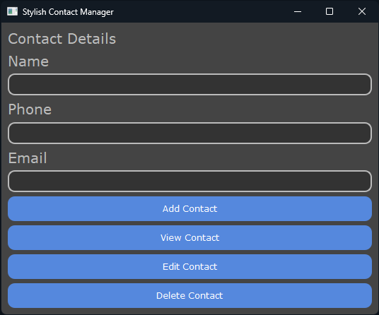
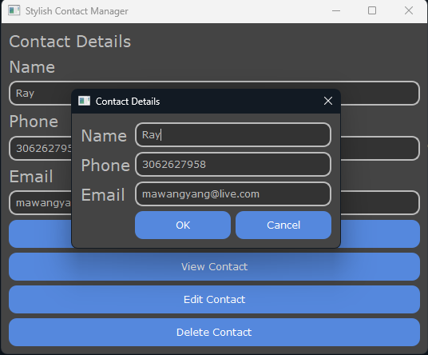
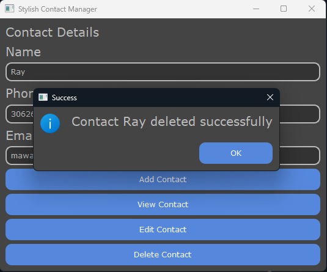

# Contact Management System

This Contact Management System is a Python-based application designed with PyQt6 for a seamless user interface and JSON for robust, local data storage. Manage your contacts with efficiency and ease directly on your local system.



Main



Add Function



Delete Function

## Features

1. **Add Contact:** Permits you to create a new contact with details such as Name, Phone Number, and Email.

2. **View Contact:** Lets you browse the details of an existing contact.

3. **Edit Contact:** Allows you to modify the details of an existing contact.

4. **Delete Contact:** Provides an option to delete an existing contact from the system.

All contact information is stored locally in a `contacts.json` file, which ensures that your data remains safe, secure, and easily accessible.

## Installation & Usage

First, clone this repository to your local machine. Ensure you have Python and PyQt6 installed. Then, navigate to the repository's directory in your terminal or command line interface and run the Python file:

```bash
python ContactManagementSystem.py

```

This command will open up the GUI of the Contact Management System, where you can perform various operations related to your contacts.

## Contributions

We welcome contributions that can enhance this project further. Feel free to fork this project, submit changes, and create a pull request. We appreciate your efforts to make this project better.
